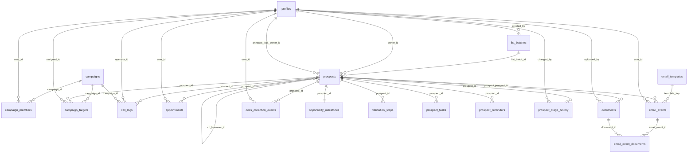

# Documentation base de données — CRM Réassurezvous (Supabase / Postgres)

Dernière mise à jour : 2026-02-27  
Environnement analysé : Supabase **CRM DEV** (Postgres 17).

Ce document décrit **en détail** le schéma de la base (schéma `public`) : tables, relations, enumérations, vues, triggers, fonctions SQL (RPC) et règles d’accès (RLS).

> Note : le CRM utilise Supabase (PostgREST + RPC). Beaucoup d’opérations applicatives sont donc soit :
> - des requêtes directes sur tables (`supabase.from(...)`), soit
> - des appels de fonctions SQL (`supabase.rpc(...)`) exécutées côté DB.

---

## 1) Vue d’ensemble

### 1.1 Schéma couvert
- Schéma : `public`
- Tables : 20 tables applicatives
- Vues : 4 vues (principalement pour simplifier des requêtes UI)
- RLS : **activée sur toutes les tables** du schéma `public`

### 1.2 Types d’identifiants
Le schéma mélange deux types d’identifiants :
- **UUID** : entités “métier” fortement liées à Supabase Auth (ex : `profiles.id`, `prospects.id`)
- **BIGINT** (séquences) : entités “événementielles / historiques” (ex : `call_logs.id`, `appointments.id`, `documents.id`, etc.)

### 1.3 Diagramme relationnel (simplifié)

---

## 2) Rôles et RBAC (RLS + helpers SQL)

### 2.1 Table `public.profiles` (rôle applicatif)
Le rôle applicatif est stocké dans `profiles.role` (enum `app_role`) :
- `admin`
- `manager`
- `operator`

### 2.2 Fonctions d’aide (utilisées dans les policies)
- `current_app_role()` : retourne le rôle de `auth.uid()` (fallback `operator`)
- `is_admin()` : vrai si rôle `admin`
- `is_manager_or_admin()` : vrai si rôle `admin` ou `manager`

### 2.3 Principes RLS (à connaître)
Toutes les tables du schéma `public` ont **RLS activée**.

Sur **CRM DEV**, les policies RLS sont organisées en deux couches :

1) **Policies techniques** pour le rôle `authenticated` (souvent suffixées `*_auth`)  
   Elles sont généralement **très permissives** (ex : `SELECT/UPDATE/DELETE` avec `qual = true`, `INSERT/UPDATE` avec `with_check = true`).

2) **Policies métier** (souvent pour le rôle `public`)  
   Elles expriment des règles plus fines : ownership (`prospects.owner_id`), cibles de campagnes (`campaign_targets.assigned_to`), etc.

Conséquence : dans cet environnement, une partie importante de la sécurité opérationnelle et des parcours repose aussi sur l’application (front + routes serveur) : pages protégées (`AccessGuard`), filtres côté UI, utilisation de RPC “guardées”, etc.

> Ce document reflète l’état de **CRM DEV** au 2026-02-27. Les règles exactes peuvent différer en PROD.

### 2.4 Contraintes DB réellement “structurantes”
Indépendamment des policies, certaines règles sont **imposées par la DB** (contraintes, triggers, FK) et s’appliquent à tous :
- `campaign_targets` : un assignee doit être membre de la campagne (FK `(campaign_id, assigned_to) → campaign_members`)
- `appointments` : un seul RDV `PLANNED` par prospect (index unique partiel)
- `prospects` : interdiction de reset `phoning_disposition` à `NULL` (trigger)
- `documents` : cohérence `required/status` + recalcul automatique de `prospects.docs_status` (triggers)
- `campaigns` : campagne archivée verrouillée (trigger, hors service role)

---

## 3) Enumérations (types `USER-DEFINED`)

Liste des enums présents dans `public` :

- `app_role` : `admin | manager | operator`
- `appointment_status` : `PLANNED | DONE | NO_SHOW | CANCELED`
- `call_disposition_enum` : `none | appointment_set | callback | ko`
- `call_outcome_enum` : `answered | no_answer | voicemail | busy | wrong_number | not_interested | unknown`
- `campaign_status_enum` : `INACTIVE | ACTIVE | ARCHIVED | PAUSED`
- `civility_enum` : `M. | Mme | Mlle`
- `doc_item_status` : `REQUESTED | PENDING | INCOMPLETE | RECEIVED | NOT_REQUIRED`
- `docs_collection_event_type` : `INITIAL_REQUEST | REMINDER_SENT`
- `docs_status_enum` : `PENDING | INCOMPLETE | COMPLETE`
- `employment_status_enum` : `FONCTIONNAIRE | INDEPENDANT | SALA_PRIVE | RETRAITE`
- `geo_zone_enum` : `IDF | PROVINCE | DROMCOM | UNKNOWN`
- `housing_status_enum` : `LOCATAIRE | PROPRIETAIRE | HEBERGE`
- `phoning_disposition_enum` : `A_RAPPELER | REFUS | MAUVAISE_COMM | NRP | REPONDEUR | INTERESSE | KO`
- `reminder_status_enum` : `PLANNED | DONE | CANCELED`
- `source_enum` : `PARRAINAGE | LEAD | LISTE_ACHETEE`
- `stage_enum` : `PHONING | OPPORTUNITY | VALIDATION | CONTRACT`
- `task_priority_enum` : `LOW | MEDIUM | HIGH`
- `validation_step_enum` : `ADHESION_COMPTE_OK | ADHESION_REMPLIE | BPA_EDITE | BPA_SIGNE | DOSSIER_ENVOYE_BANQUE | BANQUE_OK_AVENANT_EDITE | AVENANT_SIGNE | EFFET_CONTRAT | INFOS_COMPLEMENTAIRES | ETAPE_MEDICALE | MODIF_BANQUE_DEMANDEE | MODIF_BANQUE_VALIDEE | DOSSIER_RENVOYE_BANQUE_APRES_MODIF | DELEGATION_ANCIEN_ASSUREUR`

---

## 4) Tables (référence détaillée)

### 4.1 `public.profiles`
**Rôle :** profils applicatifs CRM (liés à Supabase Auth).

- **PK** : `id (uuid)`
- **Champs clés** :
  - `role (app_role)` : rôle applicatif
  - `is_blocked (bool)` : blocage côté UI
  - `smtp_psswd (text)` : mot de passe SMTP chiffré (géré côté serveur/front)

| Colonne | Type | Null | Défaut |
|---|---|---:|---|
| `id` | `uuid` | non | `gen_random_uuid()` |
| `first_name` | `text` | oui |  |
| `last_name` | `text` | oui |  |
| `username` | `text` | oui |  |
| `email` | `text` | oui |  |
| `role` | `app_role` | non | `'operator'::app_role` |
| `created_at` | `timestamptz` | non | `now()` |
| `smtp_psswd` | `text` | oui |  |
| `is_blocked` | `bool` | non | `false` |
| `phone_e164` | `text` | oui |  |

**Contraintes notables :**
- Check `phone_e164` : format `+33XXXXXXXXX` si non-null.

**Sync avec Supabase Auth :**
- Trigger `auth.users` `AFTER INSERT` → `handle_new_user()` (crée `profiles`).
- Trigger `auth.users` `AFTER UPDATE` → `sync_user_email_to_profile()` (synchronise `profiles.email`).

---

### 4.2 `public.list_batches`
**Rôle :** lots / listes de prospects importés ou créés (avec visibilité public/privé).

- **PK** : `id (bigint)`
- **FK** : `created_by → profiles.id`
- **Index** : `ux_list_batches_label_ci` (unicité sur `lower(label)`), index sur `is_public`.

| Colonne | Type | Null | Défaut |
|---|---|---:|---|
| `id` | `int8` | non | `nextval('list_batches_id_seq')` |
| `label` | `text` | non |  |
| `obtained_on` | `date` | oui |  |
| `source` | `source_enum` | oui |  |
| `size_hint` | `int4` | oui |  |
| `created_by` | `uuid` | oui |  |
| `created_at` | `timestamptz` | non | `now()` |
| `is_public` | `bool` | non | `true` |

---

### 4.3 `public.staging_raw_prospects`
**Rôle :** table de **staging** pour import (CSV/XLSX). Les champs sont majoritairement des `text` “bruts”.

> Cette table n’a pas d’index déclarés dans CRM DEV.

| Colonne | Type | Null | Défaut |
|---|---|---:|---|
| `batch_label` | `text` | oui |  |
| `first_name` | `text` | oui |  |
| `last_name` | `text` | oui |  |
| `phone` | `text` | oui |  |
| `email` | `text` | oui |  |
| `civility` | `text` | oui |  |
| `birth_date` | `text` | oui |  |
| `address1` | `text` | oui |  |
| `address2` | `text` | oui |  |
| `postal_code` | `text` | oui |  |
| `city` | `text` | oui |  |
| `net_salary` | `text` | oui |  |
| `co_borrower` | `text` | oui |  |
| `co_net_salary` | `text` | oui |  |
| `comments` | `text` | oui |  |
| `annexes` | `text` | oui |  |
| `annexes_private` | `text` | oui |  |
| `source` | `text` | oui |  |
| `employment_status` | `employment_status_enum` | oui |  |
| `housing_status` | `housing_status_enum` | oui |  |
| `city_norm` | `text` | oui |  |

**Triggers :**
- `set_city_norm_staging` (BEFORE INSERT/UPDATE) → `trg_set_city_norm()` (normalisation `city_norm`).

**Fonctions d’import associées :**
- `import_prospects_from_staging(p_batch_label, p_obtained_on, p_source, p_is_public)`  
  → crée un `list_batch`, puis insère dans `prospects` en normalisant email/téléphone/valeurs numériques + naissance.
- `staging_promote_batch(p_batch_label, p_is_public)`  
  → crée un `list_batch` et importe uniquement les lignes du batch.
- `staging_raw_prospects_clear_batch(p_batch_label)` / `staging_raw_prospects_truncate()`

---

### 4.4 `public.prospects`
**Rôle :** table centrale “prospect” (identité, contact, statut, affectation, pipeline).

- **PK** : `id (uuid)`
- **FK** :
  - `list_batch_id → list_batches.id`
  - `owner_id → profiles.id`
  - `annexes_lock_owner_id → profiles.id`
  - `co_borrower_id → prospects.id` (auto-référence)
- **Index** : `owner_id`, `list_batch_id`, `stage`, `phoning_disposition`, `geo_zone`, `employment_status`, `housing_status`, `email`, `phone_e164`, `net_salary`, etc.

| Colonne | Type | Null | Défaut |
|---|---|---:|---|
| `id` | `uuid` | non | `gen_random_uuid()` |
| `list_batch_id` | `int8` | oui |  |
| `first_name` | `text` | oui |  |
| `last_name` | `text` | oui |  |
| `civility` | `civility_enum` | oui |  |
| `birth_date` | `date` | oui |  |
| `address1` | `text` | oui |  |
| `address2` | `text` | oui |  |
| `postal_code` | `text` | oui |  |
| `city` | `text` | oui |  |
| `email` | `text` | oui |  |
| `phone_e164` | `text` | oui |  |
| `net_salary` | `numeric` | oui |  |
| `has_co_borrower` | `bool` | oui |  |
| `co_net_salary` | `numeric` | oui |  |
| `comments` | `text` | oui |  |
| `annexes` | `text` | oui |  |
| `annexes_private` | `bool` | non | `false` |
| `annexes_lock_owner_id` | `uuid` | oui |  |
| `call_count` | `int4` | non | `0` |
| `last_call_at` | `timestamptz` | oui |  |
| `source` | `source_enum` | oui |  |
| `owner_id` | `uuid` | oui |  |
| `stage` | `stage_enum` | non | `'PHONING'::stage_enum` |
| `stage_changed_at` | `timestamptz` | oui |  |
| `archived_at` | `timestamptz` | oui |  |
| `ko_reason` | `text` | oui |  |
| `phoning_disposition` | `phoning_disposition_enum` | oui |  |
| `docs_status` | `docs_status_enum` | oui |  |
| `validation_step` | `validation_step_enum` | oui |  |
| `created_at` | `timestamptz` | non | `now()` |
| `updated_at` | `timestamptz` | non | `now()` |
| `phoning_failed_attempts_count` | `int4` | non | `0` |
| `phoning_last_failed_at` | `timestamptz` | oui |  |
| `phoning_last_failed_code` | `phoning_disposition_enum` | oui |  |
| `employment_status` | `employment_status_enum` | oui |  |
| `housing_status` | `housing_status_enum` | oui |  |
| `geo_zone` | `geo_zone_enum` | oui |  |
| `has_delegation` | `bool` | oui |  |
| `archived` | `bool` | non | `false` |
| `is_co_borrower` | `bool` | non | `false` |
| `co_borrower_id` | `uuid` | oui |  |
| `is_smoker` | `bool` | oui |  |
| `dangerous_job` | `bool` | oui |  |

**Contraintes notables :**
- Check `phone_e164` : format `+33XXXXXXXXX` si non-null.

**Triggers (règles automatiques) :**
- `tgn_prospects_normalize_phone` (BEFORE INSERT/UPDATE) → `trg_prospects_normalize_phone()`  
  Normalise `phone_e164` au format FR E.164.
- `trg_prospect_geo_zone` (BEFORE INSERT/UPDATE) → `trg_prospect_geo_zone()`  
  Calcule `geo_zone` depuis `postal_code` via `classify_geo_zone(cp)`.
- `trg_no_reset_phoning_disposition` (BEFORE UPDATE) → `prevent_phoning_disposition_reset()`  
  Interdit de repasser `phoning_disposition` à `NULL` une fois défini.
- `trg_prospects_updated_at` (BEFORE UPDATE) → `set_updated_at()`  
  Met à jour `updated_at`.
- `trg_stage_change` (BEFORE UPDATE) → `log_stage_change()`  
  Met à jour `stage_changed_at` + insère un historique en `prospect_stage_history`.

**Fonctions métier (exemples) :**
- `prospect_to_opportunity(prospect_id, note)` : stage → `OPPORTUNITY`
- `prospect_to_validation(prospect_id, note)` : stage → `VALIDATION`
- `prospect_mark_refused(prospect_id, reason)` : `phoning_disposition='REFUS'` + `ko_reason`
- `prospect_mark_ko(prospect_id, reason)` : `phoning_disposition='KO'` + `ko_reason`

---

### 4.5 `public.campaigns`
**Rôle :** campagnes (filtres + méta + statut).

- **PK** : `id (bigint)`
- **FK** : `created_by → profiles.id`
- **Unique** : `special_key` (campagnes “système”)

| Colonne | Type | Null | Défaut |
|---|---|---:|---|
| `id` | `int8` | non | `nextval('campaigns_id_seq')` |
| `name` | `text` | non |  |
| `start_at` | `date` | oui |  |
| `end_at` | `date` | oui |  |
| `filter_json` | `jsonb` | oui |  |
| `created_by` | `uuid` | oui |  |
| `created_at` | `timestamptz` | non | `now()` |
| `status` | `campaign_status_enum` | non | `'INACTIVE'` |
| `status_changed_at` | `timestamptz` | oui |  |
| `activated_at` | `timestamptz` | oui |  |
| `archived_at` | `timestamptz` | oui |  |
| `special_key` | `text` | oui |  |

**Triggers :**
- `trg_campaigns_00_apply_meta_from_filter_json` (BEFORE INSERT)  
  → `trg_campaigns_apply_meta_from_filter_json()` (applique `meta.status/start_at/end_at`).
- `trg_campaigns_status_audit_biu` (BEFORE INSERT/UPDATE)  
  → `trg_campaigns_status_audit()` (timestamps `status_changed_at`, `activated_at`, `archived_at`).
- `trg_campaigns_lock_when_archived_bu` (BEFORE UPDATE)  
  → `trg_campaigns_lock_when_archived()` (verrouille une campagne archivée, sauf service role).

**Fonctions associées :**
- `campaign_set_status(campaign_id, status)` : change le statut (manager/admin requis)

---

### 4.6 `public.campaign_members`
**Rôle :** membres d’une campagne (N–N entre `campaigns` et `profiles`).

- **PK** : `(campaign_id, user_id)`
- **FK** : `campaign_id → campaigns.id`, `user_id → profiles.id`

| Colonne | Type | Null | Défaut |
|---|---|---:|---|
| `campaign_id` | `int8` | non |  |
| `user_id` | `uuid` | non |  |

**Fonction utile :**
- `campaign_members_ensure_all_operators(campaign_id)` : ajoute tous les `profiles.role='operator'` comme membres

---

### 4.7 `public.campaign_targets`
**Rôle :** cibles d’une campagne (snapshot des prospects inclus) + assignation.

- **PK** : `id (bigint)`
- **FK** :
  - `campaign_id → campaigns.id`
  - `prospect_id → prospects.id`
  - `assigned_to → profiles.id`
  - contrainte forte : `(campaign_id, assigned_to) → campaign_members(campaign_id, user_id)` (deferrable)
- **Unique index** : `(campaign_id, prospect_id)` (pas de doublon dans une campagne)

| Colonne | Type | Null | Défaut |
|---|---|---:|---|
| `id` | `int8` | non | `nextval('campaign_targets_id_seq')` |
| `campaign_id` | `int8` | oui |  |
| `prospect_id` | `uuid` | oui |  |
| `assigned_to` | `uuid` | oui |  |
| `status` | `text` | oui |  |
| `created_at` | `timestamptz` | non | `now()` |

**Fonctions majeures (allocation / transfert) :**
- `campaign_create_from_filters(...)` : crée une campagne + cibles, assigne en **round-robin** les prospects éligibles, met à jour `prospects.owner_id`
- `campaign_targets_sync_from_owner(campaign_id, member_ids, mirror_only)` : miroir `prospects.owner_id` → `campaign_targets.assigned_to` (+ round-robin si nécessaire)
- `campaign_transfer_targets(campaign_id, from, to, cancel_future_appts)` : transfère owners + cibles
- `campaign_takeover(campaign_id, new_owner, cancel_future_appts)` : réassigne toutes les cibles à un owner unique

---

### 4.8 `public.call_logs`
**Rôle :** historisation des appels (téléphonie).

- **PK** : `id (bigint)`
- **FK** : `prospect_id → prospects.id`, `operator_id → profiles.id`, `campaign_id → campaigns.id` (optionnel)

| Colonne | Type | Null | Défaut |
|---|---|---:|---|
| `id` | `int8` | non | `nextval('call_logs_id_seq')` |
| `prospect_id` | `uuid` | oui |  |
| `operator_id` | `uuid` | oui |  |
| `campaign_id` | `int8` | oui |  |
| `started_at` | `timestamptz` | non | `now()` |
| `ended_at` | `timestamptz` | oui |  |
| `duration_seconds` | `int4` | oui |  |
| `outcome` | `call_outcome_enum` | oui |  |
| `disposition` | `call_disposition_enum` | non | `'none'` |
| `note` | `text` | oui |  |
| `next_callback_at` | `timestamptz` | oui |  |
| `created_at` | `timestamptz` | non | `now()` |

**Contraintes / triggers :**
- Check `ended_at >= started_at` si `ended_at` non-null.
- Trigger `trg_call_logs_duration` (BEFORE INSERT/UPDATE) → `set_call_duration()` (calcule `duration_seconds`)
- Trigger `trg_call_failed_attempts` (AFTER INSERT) → `bump_failed_attempts_from_call()`  
  Met à jour `prospects.phoning_failed_attempts_*` selon `outcome`.

**Fonctions associées :**
- `map_outcome_to_failed_code(outcome)` : mappe `no_answer/voicemail/busy` → `NRP/REPONDEUR/MAUVAISE_COMM`
- `recount_failed_attempts(prospect_id?)` : recalcul des compteurs depuis `call_logs`

---

### 4.9 `public.appointments`
**Rôle :** RDV planifiés / effectués / annulés.

- **PK** : `id (bigint)`
- **FK** : `prospect_id → prospects.id`, `user_id → profiles.id`
- **Index unique partiel** : 1 seul RDV `PLANNED` par prospect (`uniq_planned_rdv_per_prospect`)

| Colonne | Type | Null | Défaut |
|---|---|---:|---|
| `id` | `int8` | non | `nextval('appointments_id_seq')` |
| `prospect_id` | `uuid` | oui |  |
| `user_id` | `uuid` | oui |  |
| `start_at` | `timestamptz` | non |  |
| `end_at` | `timestamptz` | oui |  |
| `title` | `text` | oui |  |
| `notes` | `text` | oui |  |
| `created_at` | `timestamptz` | non | `now()` |
| `status` | `appointment_status` | non | `'PLANNED'` |
| `attended_at` | `timestamptz` | oui |  |

**Fonctions (RPC) :**
- `appointment_plan(prospect_id, start_at, user_id?)` : crée un RDV `PLANNED`
- `appointment_close_latest(prospect_id, outcome DONE|NO_SHOW)` : clôture le dernier `PLANNED`
- `appointment_reschedule(appointment_id, start_at, user_id?)` : replanifie un RDV `PLANNED` (non utilisé par le front actuel)

---

### 4.10 `public.documents`
**Rôle :** suivi des documents requis (statuts, fichier Storage, relances).

- **PK** : `id (bigint)`
- **FK** : `prospect_id → prospects.id`, `uploaded_by → profiles.id`
- **Uniques** :
  - `uniq_documents_prospect_kind_non_custom` : `(prospect_id, kind)` pour documents “non custom”
  - `uniq_documents_prospect_label_custom` : `(prospect_id, label, is_custom)` pour documents “custom”
- **Check** : cohérence `required` vs `status` (si `required=false` ⇒ `status=NOT_REQUIRED`)

| Colonne | Type | Null | Défaut |
|---|---|---:|---|
| `id` | `int8` | non | `nextval('documents_id_seq')` |
| `prospect_id` | `uuid` | oui |  |
| `doc_type` | `text` | oui |  |
| `status` | `doc_item_status` | oui |  |
| `file_path` | `text` | oui |  |
| `uploaded_by` | `uuid` | oui |  |
| `uploaded_at` | `timestamptz` | non | `now()` |
| `requested_at` | `timestamptz` | oui |  |
| `received_at` | `timestamptz` | oui |  |
| `last_reminder_at` | `timestamptz` | oui |  |
| `reminder_count` | `int4` | oui | `0` |
| `label` | `text` | oui |  |
| `kind` | `text` | oui |  |
| `is_custom` | `bool` | non | `false` |
| `required` | `bool` | non | `false` |

**Triggers :**
- `trg_documents_enforce_required_status` (BEFORE INSERT/UPDATE)  
  → `trg_documents_enforce_required_status()` : force la cohérence `required/status`
- `documents_after_change` (AFTER INSERT/UPDATE/DELETE)  
  → `trg_documents_after_change()` : recalcule `prospects.docs_status` via `recompute_docs_status(prospect_id)`

**Fonctions associées :**
- `start_docs_collection(prospect_id)` : initialise la collecte (milestone + `documents.status='REQUESTED'` si `NULL`)
- `recompute_docs_status(prospect_id)` : calcule `prospects.docs_status` + met à jour `opportunity_milestones` (dates docs)

---

### 4.11 `public.opportunity_milestones`
**Rôle :** jalons temporels (collecte docs, devis, relances).

- **PK** : `prospect_id (uuid)` (1–1 avec `prospects`)
- **FK** : `prospect_id → prospects.id`

| Colonne | Type | Null | Défaut |
|---|---|---:|---|
| `prospect_id` | `uuid` | non |  |
| `docs_requested_at` | `timestamptz` | oui |  |
| `docs_first_received_at` | `timestamptz` | oui |  |
| `docs_completed_at` | `timestamptz` | oui |  |
| `quote_sent_at` | `timestamptz` | oui |  |
| `quote_signed_at` | `timestamptz` | oui |  |
| `last_reminder_at` | `timestamptz` | oui |  |
| `reminder_count` | `int4` | oui | `0` |

**Fonctions associées :**
- `opportunity_mark_quote_sent(prospect_id)` : renseigne `quote_sent_at` (sans écraser si déjà présent)
- `opportunity_record_reminder(prospect_id)` : incrémente `reminder_count` + met à jour `last_reminder_at`

---

### 4.12 `public.validation_steps`
**Rôle :** historique des étapes de validation (traçabilité).

- **PK** : `id (bigint)`
- **FK** : `prospect_id → prospects.id`
- **Unique index** : `(prospect_id, step)` (pas de doublon sur une étape)

| Colonne | Type | Null | Défaut |
|---|---|---:|---|
| `id` | `int8` | non | `nextval('validation_steps_id_seq')` |
| `prospect_id` | `uuid` | oui |  |
| `step` | `validation_step_enum` | non |  |
| `done_at` | `timestamptz` | non | `now()` |
| `in_progress` | `bool` | oui | `false` |
| `note` | `text` | oui |  |

---

### 4.13 `public.prospect_tasks`
**Rôle :** tâches liées à un prospect (todo).

- **PK** : `id (bigint)` (identity)
- **FK** : `prospect_id → prospects.id`, `created_by → profiles.id`

| Colonne | Type | Null | Défaut |
|---|---|---:|---|
| `id` | `int8` | non | identity |
| `prospect_id` | `uuid` | non |  |
| `task_date` | `date` | non |  |
| `priority` | `task_priority_enum` | non | `'MEDIUM'` |
| `note` | `text` | oui |  |
| `status` | `reminder_status_enum` | non | `'PLANNED'` |
| `created_at` | `timestamptz` | non | `now()` |
| `updated_at` | `timestamptz` | non | `now()` |
| `created_by` | `uuid` | oui |  |
| `completed_at` | `timestamptz` | oui |  |
| `reschedule_count` | `int4` | non | `0` |

**Trigger :**
- `set_updated_at` (BEFORE UPDATE) → `set_updated_at()`

---

### 4.14 `public.prospect_reminders`
**Rôle :** rappels (similaires aux tâches, avec éventuellement une heure).

- **PK** : `id (bigint)`
- **FK** : `prospect_id → prospects.id`, `created_by → profiles.id`
- **Index unique partiel** : 1 seul rappel `PLANNED` par prospect (`uniq_prospect_reminder_planned`)

| Colonne | Type | Null | Défaut |
|---|---|---:|---|
| `id` | `int8` | non | `nextval('prospect_reminders_id_seq')` |
| `prospect_id` | `uuid` | non |  |
| `reminder_date` | `date` | non |  |
| `note` | `text` | oui |  |
| `status` | `reminder_status_enum` | non | `'PLANNED'` |
| `created_at` | `timestamptz` | non | `now()` |
| `updated_at` | `timestamptz` | non | `now()` |
| `created_by` | `uuid` | oui |  |
| `completed_at` | `timestamptz` | oui |  |
| `reschedule_count` | `int4` | non | `0` |
| `reminder_time` | `time` | oui |  |

**Trigger :**
- `set_updated_at` (BEFORE UPDATE) → `set_updated_at()`

---

### 4.15 `public.prospect_stage_history`
**Rôle :** audit des transitions `prospects.stage`.

- **PK** : `id (bigint)`
- **FK** : `prospect_id → prospects.id`, `changed_by → profiles.id`

| Colonne | Type | Null | Défaut |
|---|---|---:|---|
| `id` | `int8` | non | `nextval('prospect_stage_history_id_seq')` |
| `prospect_id` | `uuid` | oui |  |
| `from_stage` | `stage_enum` | oui |  |
| `to_stage` | `stage_enum` | oui |  |
| `changed_at` | `timestamptz` | non | `now()` |
| `changed_by` | `uuid` | oui |  |
| `note` | `text` | oui |  |

**Alimentation :**
- Trigger sur `prospects` : `log_stage_change()` insère automatiquement l’historique.

---

### 4.16 `public.email_templates`
**Rôle :** templates emails (référence fonctionnelle + stockage Markdown).

- **PK** : `id (bigint)`
- **Unique** : `template_key (text)`

| Colonne | Type | Null | Défaut |
|---|---|---:|---|
| `id` | `int8` | non | `nextval('email_templates_id_seq')` |
| `template_key` | `text` | non |  |
| `subject` | `text` | oui |  |
| `body_md` | `text` | oui |  |

---

### 4.17 `public.email_events`
**Rôle :** journalisation des emails envoyés (audit UI / suivi).

- **PK** : `id (bigint)`
- **FK** :
  - `template_key → email_templates.template_key` (nullable)
  - `prospect_id → prospects.id`
  - `user_id → profiles.id`

| Colonne | Type | Null | Défaut |
|---|---|---:|---|
| `id` | `int8` | non | `nextval('email_events_id_seq')` |
| `template_key` | `text` | oui |  |
| `prospect_id` | `uuid` | oui |  |
| `user_id` | `uuid` | oui |  |
| `sent_at` | `timestamptz` | non | `now()` |
| `subject` | `text` | oui |  |

---

### 4.18 `public.email_event_documents`
**Rôle :** liaison N–N entre emails envoyés (`email_events`) et documents (`documents`).

- **PK** : `(email_event_id, document_id)`
- **FK** : `email_event_id → email_events.id`, `document_id → documents.id`

| Colonne | Type | Null | Défaut |
|---|---|---:|---|
| `email_event_id` | `int8` | non |  |
| `document_id` | `int8` | non |  |

---

### 4.19 `public.docs_collection_events`
**Rôle :** journalisation des actions de collecte de documents (demande initiale, relances).

- **PK** : `id (bigint)`
- **FK** : `prospect_id → prospects.id`, `user_id → profiles.id`

| Colonne | Type | Null | Défaut |
|---|---|---:|---|
| `id` | `int8` | non | `nextval('docs_collection_events_id_seq')` |
| `prospect_id` | `uuid` | non |  |
| `event_type` | `docs_collection_event_type` | non |  |
| `event_at` | `timestamptz` | non | `now()` |
| `user_id` | `uuid` | oui |  |
| `email_subject` | `text` | oui |  |
| `email_html` | `text` | oui |  |

---

### 4.20 `public.geo_city_index`
**Rôle :** index géographique (ville, CP, INSEE, bucket `geo_zone_enum`).

- **PK** : `id (bigint)`
- **Unique index** : `(city_norm, postal_code)`

| Colonne | Type | Null | Défaut |
|---|---|---:|---|
| `id` | `int8` | non | `nextval('geo_city_index_id_seq')` |
| `insee_code` | `text` | non |  |
| `postal_code` | `text` | non |  |
| `city_name` | `text` | non |  |
| `dept_code` | `text` | non |  |
| `region_name` | `text` | oui |  |
| `bucket` | `geo_zone_enum` | oui |  |
| `city_norm` | `text` | oui |  |

**Trigger :**
- `set_city_norm_geo` (BEFORE INSERT/UPDATE) → `_set_city_norm_from_name()`

**Fonctions associées :**
- `classify_geo_zone(cp)` : classification simple (IDF/PROVINCE/DROMCOM/UNKNOWN)
- `compute_geo_zone(postal_code, city_norm)` : utilise `geo_city_index` en fallback

---

## 5) Vues (`public`)

### 5.1 `campaigns_for_current_user`
Retourne :
- les campagnes où l’utilisateur est assigné (`campaign_targets.assigned_to = auth.uid()`),
- **ou** toutes les campagnes si `is_manager_or_admin()`.

### 5.2 `latest_appointment_per_prospect`
Pour chaque prospect : dernier RDV (par `start_at` puis `created_at`).

### 5.3 `v_next_planned_appointment`
Pour chaque prospect : prochain RDV `PLANNED` (par `min(start_at)`).

### 5.4 `v_docs_collection_stats`
Statistiques agrégées de collecte documentaire :
- `first_request_at`
- `last_reminder_at`
- `reminder_count`

---

## 6) Fonctions SQL (RPC) — panorama

### 6.1 Campagnes & attribution
- `campaign_create_from_filters(...)` : création campagne + cibles + round-robin + owner
- `campaign_targets_sync_from_owner(campaign_id, member_ids?, mirror_only?)`
- `campaign_transfer_targets(campaign_id, from, to, cancel_future_appts?)`
- `campaign_takeover(campaign_id, new_owner, cancel_future_appts?)`
- `campaign_set_status(campaign_id, status)`

### 6.2 Prospects (transitions)
- `prospect_to_opportunity(prospect_id, note?)`
- `prospect_to_validation(prospect_id, note?)`
- `prospect_mark_refused(prospect_id, reason?)`
- `prospect_mark_ko(prospect_id, reason?)`

### 6.3 RDV
- `appointment_plan(prospect_id, start_at, user_id?)`
- `appointment_close_latest(prospect_id, DONE|NO_SHOW)`

### 6.4 Import & listes
- `import_prospects_from_staging(batch_label?, obtained_on?, source?, is_public?)`
- `staging_promote_batch(batch_label, is_public?)`
- `staging_raw_prospects_clear_batch(batch_label)`
- `staging_raw_prospects_truncate()`
- `ensure_list_batch(label, is_public?)`

### 6.5 Documents & opportunité
- `start_docs_collection(prospect_id)`
- `recompute_docs_status(prospect_id)`
- `opportunity_mark_quote_sent(prospect_id)`
- `opportunity_record_reminder(prospect_id)`

### 6.6 Téléphonie
- `recount_failed_attempts(prospect_id?)`

---

## 7) Points d’attention (règles structurantes)

- **1 RDV planifié max par prospect** : index unique partiel sur `appointments` (status `PLANNED`).
- **Statut phoning non réversible vers “Nouveau lead”** : `prevent_phoning_disposition_reset()`.
- **Docs status calculé automatiquement** : triggers sur `documents` → `recompute_docs_status()` qui met à jour `prospects.docs_status` + jalons.
- **Campagnes verrouillées une fois archivées** : `trg_campaigns_lock_when_archived()` (sauf service role).
- **Round-robin d’attribution** : implémenté côté DB lors de `campaign_create_from_filters(...)` et `campaign_targets_sync_from_owner(...)`.
